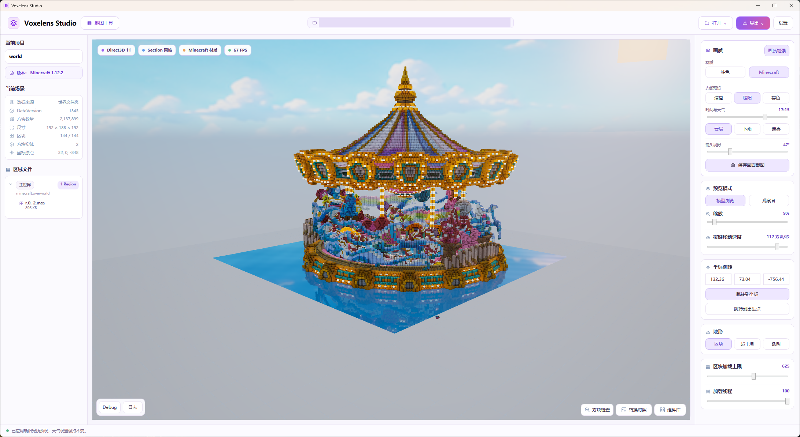
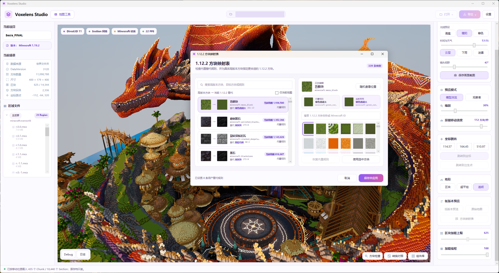
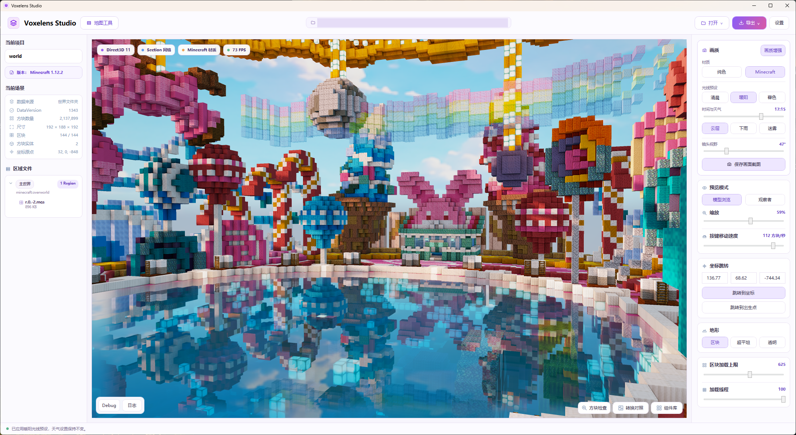
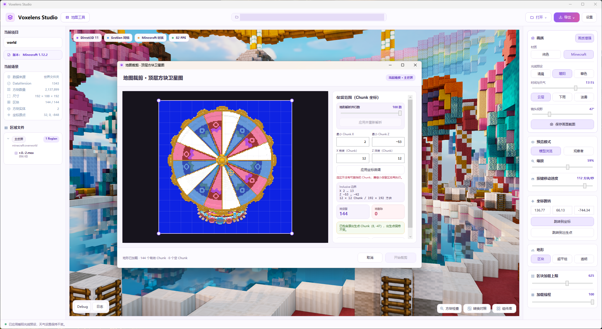
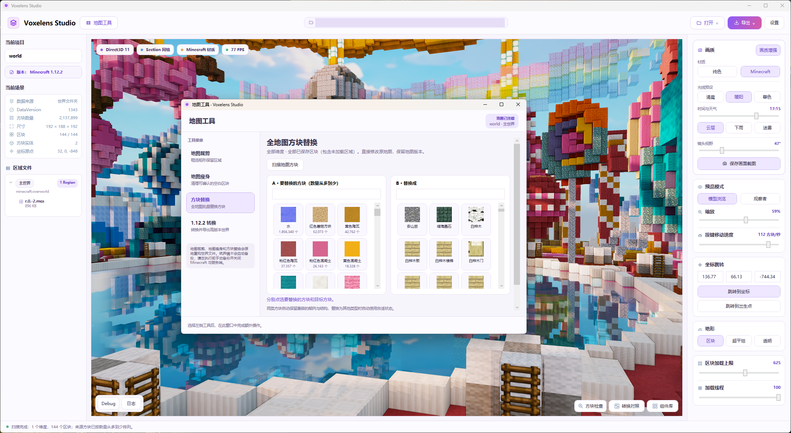
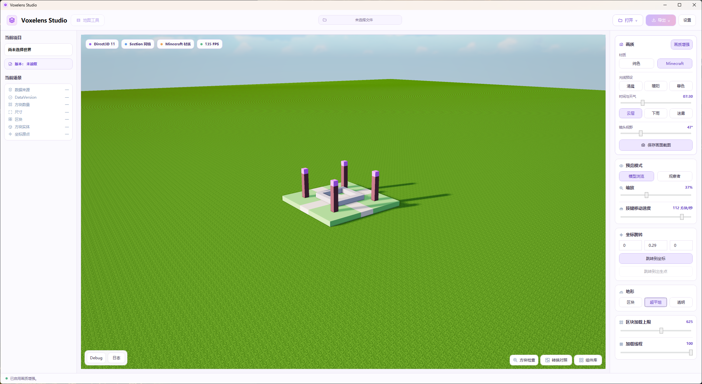

<p align="center">
  
</p>

<h1 align="center">Voxelens Studio · 筑界镜</h1>

简体中文 · [English](README.md)

[](https://qm.qq.com/q/IQmVK34dKs)

**一款现代化的 Minecraft 地图工具。**

Voxelens Studio 将地图浏览、第一人称漫游、高版本转 1.12.2、可视化裁剪和全地图方块替换整合在一个原生 Windows 桌面界面中。用真实材质查看建筑，用图标选择方块，用预览对照转换效果，让地图查看、整理和修改更直观。

**预览版本 · Windows 11 x64 · .NET 10 / WPF / Direct3D 11 · MIT**

**[直接下载 Windows 版（免安装 ZIP）](https://github.com/LuoshinDev/Voxelens-Studio/releases/download/v0.5.43/Voxelens-Studio-0.5.43-win-x64.zip)** · [版本说明](https://github.com/LuoshinDev/Voxelens-Studio/releases/tag/v0.5.43)

无需编程或安装开发工具。下载后**全部解压**，双击 `ZhuJieJing.Studio.exe` 即可；不要选择 GitHub 自动生成的 “Source code” 源码包。



从查看一座建筑，到整理整张世界地图：既能旋转浏览全景，也能切换到**第一人称，在地图内部自由移动和观察**。选择方块后自动排列相关候选，替换时处理兼容的朝向与结构数据，减少反复查找和逐项配置。

## 主要功能

- 模型浏览与第一人称观察者模式自由切换，支持 WASD 移动、鼠标转动视角和移动速度调整。
- 按 Region、Chunk、Section 流式读取 Java Anvil 世界，支持 1.12.2 数字方块和现代 Palette 格式。
- 从用户本地客户端 JAR 加载材质，提供画质增强、阴影和水面反射。
- 方块检查器显示名称、规范状态、旧版 ID:子ID 与贴图，支持原地图和转换预览对照。
- 高版本世界转 1.12.2，支持可视化方块映射、自定义替代规则与转换前预览。
- 地图裁剪、空白区块清理和全地图方块替换。
- `.zz` 蓝图、带版本历史的 `.zjjscene` 工程、待批准/已批准组件库，以及供外部 AI 工具调用的 `zjj` CLI。
- 中英文即时切换，允许编辑或新增语言文件；资源选择、地图视角和窗口配置持久保存。

## 功能详解

### 高版本转 1.12.2：先选替代，再看效果

将高版本世界转换为 1.12.2 世界。对于旧版不存在的方块，可以使用内置替代规则，也可以自己选择更接近建筑配色和材质的目标方块。

- **方块映射表：**查看“高版本方块 → 1.12.2 替代方块”，同时显示贴图、名称、旧版 ID:子ID 和当前地图中的数量。
- **搜索与筛选：**搜索来源方块或目标规则，勾选“仅当前地图”缩小查找范围。
- **自定义替代：**通过图标选择目标方块，比较内置规则与当前采用的方案；不满意时可以恢复内置规则，完成后保存并应用。
- **自动推荐排序：**切换来源方块时，右侧候选随之重新排序；当前采用的目标与内置默认目标优先，其余结合方块形状、材质、颜色名称和状态匹配程度排列。例如台阶会优先推荐相关台阶，而不是让用户从整张列表里翻找。
- **减少重复：**同类候选的朝向等状态合并展示，不会因为方向不同就出现一排相同贴图；来源优先显示当前地图实际使用、数量较多的方块。
- **现场查看：**使用“随机查看位置”跳转到该方块在地图中的一个位置，结合实际建筑判断替换是否合适。
- **低版本预览：**在“原始地图”和“低版本预览”之间切换，先看降级后的材料与造型，再决定导出。
- **转换对照：**用同步镜头比较原始与转换后的画面，检查细节变化。
- **高度处理与导出：**1.12.2 只能容纳 Y=0–255；界面会说明高度偏移，超高时需明确同意顶部裁切。转换导出到新目录，保留原地图。



映射解决的是方块兼容与外观取舍，不保证模组内容、方块实体或高版本机制能够无损降级。导出后仍需进入 Minecraft 检查。

推荐排序只帮助挑选，不会擅自覆盖用户选择。保存的自定义映射会供后续转换使用；已有转换预览会按更新后的规则重新生成。

### 大地图浏览与第一人称移动

世界按区块流式加载，可以调整区块加载上限和加载线程数。左侧提供世界版本、方块数量、尺寸、维度与 Region 文件信息，方便定位当前查看的内容。

**模型浏览**适合查看整体布局，**观察者模式**适合进入建筑内部，以第一人称自由移动。支持 WASD、鼠标转向、上下移动、速度与视野调整、坐标跳转和返回出生点；重新打开地图时恢复已保存的镜头。具体按键见下方操作说明。观察者是自由浏览模式，不模拟完整的游戏重力与碰撞。

### 材质、光照与水面反射

读取本地 Minecraft 资源 JAR 中的材质，可开启画质增强、阴影和水面反射。通过光线预设、时间和天气设置，从不同光照条件下查看建筑效果。

画质增强可以独立开关，选择光线预设不会强制开启它。支持云层、下雨、迷雾，以及区块、超平坦和透明地形背景；这些是预览设置，不会修改地图地形。可以直接保存当前画面截图。



### 可视化地图裁剪

在俯视地图上框选保留区域，按区块坐标微调边界，查看将保留和删除的区块数量后再执行裁剪。

裁剪作用于当前维度，移除选区外的区块及对应实体、POI 数据；主世界选区需要包含出生点。适合从大地图中保留一片建筑区域，执行后直接修改原世界。



### 全地图方块替换

用方块图标选择“把什么替换成什么”。来源方块按类型合并、数量从多到少排列；目标方块按类型、材质和颜色推荐相关选项。机制自动保留兼容的朝向与结构状态，无需逐一处理同一方块的不同朝向。



替换覆盖所有维度中已经保存的区块，包括当前视图尚未加载的部分，并直接更新原世界。同类型方块尽量保留兼容状态，例如门换成门时保留兼容的朝向与结构；换成不同类型时自动使用合适状态。

| 使用细节 | Studio 会怎么处理 |
| --- | --- |
| 优先找到影响最大的方块 | 来源按总数量从多到少排列，同种方块的不同状态合并计数。 |
| 点击来源后找到合适目标 | 右侧即时按相关性重排，优先考虑同类型，再综合材质、染色颜色、名称与贴图平均颜色相似度；颜色相近不会压过明显的类型差异。 |
| 一次替换所有朝向 | 选择的是方块类型，无需分别处理东南西北；机制按每个来源方块的实际状态生成兼容目标。 |
| 保留结构细节 | 门换门保留兼容的朝向、上下半部分及开合等状态；楼梯、台阶和柱状方块也按各自规则保留兼容状态。 |
| 避免生成不完整结构 | 普通单格方块不能直接替换成需要上下两格的门；不支持的结构会提示并阻止执行。 |
| 执行前确认影响范围 | 显示将替换的方块数量和维度范围，由用户确认后写入；推荐列表不会自动替用户执行。 |
| 继续下一次替换 | 完成后刷新当前场景，可以重新扫描，再进行下一组替换。 |

### 地图瘦身

先分析可清理区块，再确认执行。只清理符合条件、没有方块实体或活动数据的空白区块，保留自然地形；适合清理无用区块，不会把“没有玩家建筑”直接当成可删除区域。裁剪、瘦身与替换前均应备份并关闭游戏或服务端。

### 方块检查器

开启“方块检查”后点击画面中的方块，可以查看中英文名称、Minecraft ID、状态属性、贴图、坐标、维度及光照信息。旧版方块显示主 ID 与子 ID；转换时还会列出 1.12.2 目标，帮助定位“这个方块是什么、会变成什么”。支持复制方块信息用于反馈问题。

### AI 蓝图与组件库

外部 AI 工具可通过 `.zz` 蓝图和 `zjj` CLI 与 Studio 协作，在预览和审查后应用场景变更。组件库分为“待批准”和“已批准”，新制作内容先进入待批准，便于集中检查和管理。`.zjjscene` 工程保存场景与版本历史；软件不内置云模型账号或凭据。接入方式见[蓝图格式](docs/AI_WORLD_FORMAT.md)和[组件库](docs/COMPONENT_LIBRARY.md)。

### 语言、资源设置与性能日志

- **语言：**内置中文、英文，即时切换；安装目录的 `languages/` 允许用户修改翻译或新增语言。
- **材质资源：**分别指定 1.12.2 与高版本资源 JAR，也可自动查找；保存后持续使用，下次启动无需重选。
- **使用习惯：**按文件类型记忆打开位置，按地图保存镜头和视野，地图工具窗口记忆大小。
- **Debug：**记录性能信息，保存后显示状态；旁边的“日志”按钮打开软件目录中的日志文件夹，方便提交报告或自行清理。

<details>
<summary>查看首页演示与预览控制</summary>



</details>

以上截图由项目作者提供，展示中文界面；软件也支持英文。图中地图和 Minecraft 资源文件不随项目分发。

## 如何在地图中移动

在“预览模式”中选择**观察者**，点击画面后即可用 **WASD 移动、鼠标转动视角**，按 **Esc** 退出观察者模式。右侧可以调整“按键移动速度”和“镜头视野”，镜头位置、朝向和视野随地图保存。

需要查看建筑全貌时，切回**模型浏览**：鼠标左键拖动旋转、右键拖动平移、滚轮缩放。还可以输入坐标直接跳转，或返回地图出生点。

## 开始使用

解压 Windows x64 发布包，运行 `ZhuJieJing.Studio.exe`。发布包自带 .NET 运行时，保留同目录的 `languages/`、`licenses/` 和许可声明。

1. 在“设置”里选择语言。
2. 选择自己本机的 1.12.2 或高版本 Minecraft 客户端资源 JAR；保存后会缓存，下次启动无需重新选择。
3. 打开世界文件夹、旧版 `.schematic` 或 `.zz` 蓝图。
4. 先检查预览，再执行地图操作；资源缺失时使用纯色显示。

**地图操作边界：**读取和预览只读，转换导出写入新目录；裁剪、清理和方块替换在确认后修改原文件。执行前请自行备份地图并关闭 Minecraft 或服务端。事务回滚不能替代用户备份。

项目不附带 Minecraft 客户端 JAR、原版游戏贴图或私人地图。Voxelens Studio 为独立项目，并非 Minecraft 官方产品，未经 Mojang 或 Microsoft 认可，也不与其关联。

## 从源码构建

在 Windows 安装 [global.json](global.json) 指定的 SDK 后，于仓库根目录执行：

```powershell
dotnet restore ZhuJieJing.sln
dotnet build ZhuJieJing.sln -c Release --no-restore
dotnet run --project src/ZhuJieJing.App -c Release --no-build
```

使用 `pwsh ./tools/Publish-Studio.ps1` 生成自包含发布包。环境要求、产物和工程目录设置见 [构建指南](docs/BUILDING.md)。

## 文档与贡献

- [功能边界与已知问题](docs/KNOWN_LIMITATIONS.md)
- [自定义语言](src/ZhuJieJing.App/Localization/README.md)
- [架构](docs/ARCHITECTURE.md) · [蓝图格式](docs/AI_WORLD_FORMAT.md) · [组件库](docs/COMPONENT_LIBRARY.md)
- [更新记录](CHANGELOG.md)
- [参与贡献](CONTRIBUTING.md) · [安全反馈](SECURITY.md)

当前部分底层诊断与 CLI 输出仍为中文。转换精度和帧率取决于地图内容与硬件，导出的世界请在 Minecraft 中检查。程序集和文件协议沿用 `ZhuJieJing` 命名，以兼容已有配置和工程。

## 许可证

Copyright (c) 2026 洛神Field。原创项目代码采用 [MIT](LICENSE)；第三方依赖和改编素材沿用其各自许可证，见 [第三方声明](THIRD_PARTY_NOTICES.md) 与 [素材来源](docs/ASSETS.md)。
